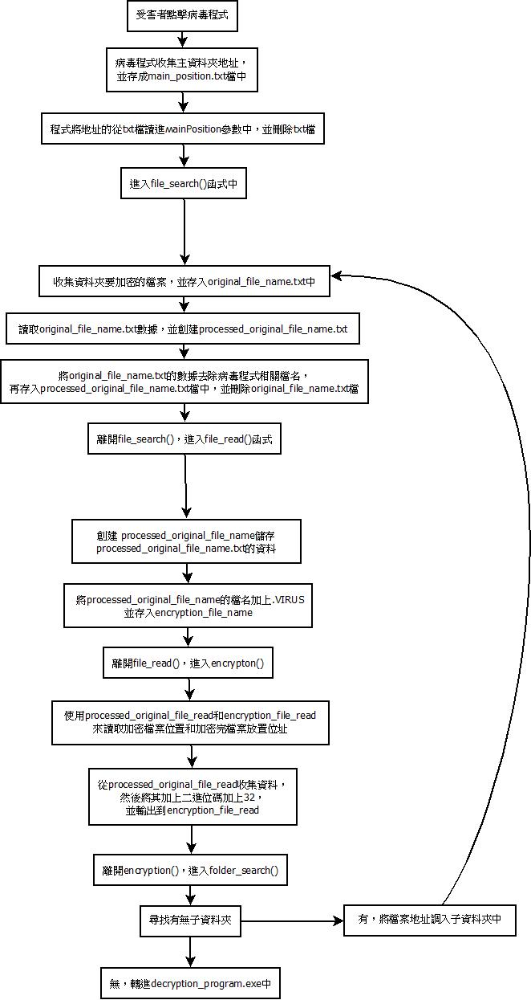
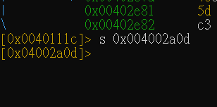

<h1 style="text-align:center">WannaFuxk勒索病毒製作報告</h1>

<h5 style="text-align:right">作者:HiCat</h5>


<h1 style="font-size: 60px;color:red;text-align:center">FBI WARNING</h1>

<h1 style="color:red;text-align:center">警告以下內容僅用於學術用途，使用後有任何金錢或法律問題，作者將不負責</h1>

#### 還有作者技術菜，有任何解釋不全或用語錯誤請諒解

---

## 目錄:

1. ###  [病毒程式製作初衷](#1)

2. ### [WannaFuxk病毒製作歷程](#2)

3. ### [WannaFuxk病毒本體介紹](#3)

4. ### [RSA加密WannaFuxk上的實作](#4)

5. ### [破解WannaFuxk](#5)

6. ### [作者感想](#6)

7. ### [感謝](#7)

---

<h2 id="1">1.病毒程式製作初衷</h2>

###							在這資訊科技發達，人手一支手機的 時代裡，資訊安全不在只是在新聞上國家和公司V.S.駭客，大眾在旁當笑話看:「XX公司怎麼會被攻擊、OO央行怎麼會被入侵，好廢喔~。」這樣如此輕鬆的話題。但大眾卻還沒改變過往的觀念，渾然不知黑帽駭客們的魔爪以悄悄地伸入我們日常生活當中了。

### 				我自主學習程式語言才不到兩年，學習的時常還沒有很多，因為我沒有特地去補習或買書來加強實力，所以常常需要使用網路來查詢資料以此來學習程式相關的知識。但在自學的這段日子裡，我發現我最常查到的網路資料都是英文的，只有少部分試中寫的。雖然寫程式會英文是必須的，但在學習程式中還要去翻譯英文，這樣的學習效率實在太低了。

### 				我個人是開源項目的追隨者，自己使用的很多軟體都是開源的。像WannaFuxk的圖標示使用lnkspace製作、程式碼編輯器是使用emacs、C語言編譯器是使用GNU GCC來編譯的、、、等。所以我也以製作項目為我人生的目標。

### 				以上的三點原因，使我開始想製作有關資訊安全的程式製作教學文檔。在我思索要開發什麼來做教學文檔時，我無意間瀏覽到WannaCry的維基百科，與資訊安全有關，我學習的C語言製作勒索軟件在是何不過了，所以WannaFuxk就此開始有了雛形出來。

---

<h2 id="2">2.WannaFuxk病毒製作歷程</h2>

### 		WannaFuxk是以滾動開發的方式進行製作。

### beta1.0版本是針對像txt檔的文字檔進行加密，製作流程還很簡陋。

### 2.0版本開始針對多檔案類型加密進行製作，程式邏輯還是使用beta的進行開發。

### 2.1版本是新的開始，程式碼和程式邏輯全部重新寫。此版本的更新開始支持子資料夾的檔案加密。

### 2.2版本加密程式沒有更新，而是對解密程式進行重寫，使它可以和使用者簡單的按鍵互動。

### 2.3版本程式也沒有新功能，而是對程式碼進行優化，使其更容易讀。

### 2.4版本是理論上的最終版本，對RSA加密進行測試。

---

<h2 id="3">3.WannaFuxk病毒本體介紹</h2>

###							WannaFuxk介紹以最終版本(2.4)進行介紹。因為解密程式和加密程式的程式邏輯差不多，所以我們在此不多贅述解密程式。再詳細介紹加密程式的程式邏輯時，先放上加密程式的流程圖，讓大家能更容易理解WannaFuxk的製作邏輯。



### 						可能會有人好奇怎麼沒有RSA加密?我其實也有嚐試將RSA加密引入文件加密的代碼中，但因為這樣效能實在會消耗龐大，和本人技術有限，所以我只好將RSA加密放進解密程式中對使用者輸入的密碼進行RSA加密來推進解密程式進行解密，詳細將在第四章[RSA加密WannaFuxk上的實作](#4)來介紹。

### 		當WannaFuxk的encryption_program.exe程式被使用者點擊後，先創建(字串函數)MainPosition，然後用system()去收集主資料夾的地址存入(字串函數)MainPosition中。進入file_search()中，使用system()收集主資料夾可加密的檔案，並存入original_file_name.txt中。再使用(FILE函數)* original_file_name_read去讀取original_file_name.txt，去除WannaFuxk使用的檔案後使用(FILE函數)* processed_original_file_name_read存入processed_original_file_name.txt中。

### 		離開file_search()，然後進入file_read()，使用(FILE函數)* processed_original_file_name_read去讀processed_original_file_name.txt，然後用(字串函數)processed_original_file_name去收集可加密檔案的檔名，並將可加密檔案的檔名加上.VIRUS並存入encryption_file_name。

### 		進入encryption()，用(FILE函數)* processed_original_file_read讀去鑰加密的檔案，將讀取的訊息二進位碼加上32，然後使用(FILE函數)* encryption_file_read去存加密完的訊息。

### 		進入folder_search()，system()收集子資夾，使用(FILE函數)* folder_name_read，然後和MainPosition合併。然後再進入file_search()進行遞迴，如過有子資料夾還有子資料夾就再進去，直到沒有子資料夾，就退到上一個資料夾，檢查還有沒有沒加資料夾，直到退回主資料夾，進入decryption_program.exe。

### 以下是子資料夾加密的流程圖:


---

<h2 id="4">4.RSA加密WannaFuxk上的實作</h2>

### 						在講解RSA加密WannaFuxk上的實作前，我們先來看看RSA是如何進行加解密的。


### 		在進行RSA加密前，我們先要找幾個數，才能成功進行接下來的流程:

#### 					1. 找兩個質數p和q，並且p和q不相同。在算出 N = p * q。

#### 					2. 在用歐拉函數，求得 r = ( p - 1 ) * ( q - 1 )。

#### 					3. 在選擇一個小於 r 的整數 e，並且 e 與 r 要互質。

####						4. 最後找出 d，並且 d * e  除以 r 的餘數要等於 1 。


### 		這樣我們就可以開始進行我們的RAS加密了:

### 			M = 原始訊息、C = 加密完的密文

### 			加密訊息(C) :  C = M 的 e 次方除 r 的餘數。

### 			解密訊息(M) :  M = C 的 d 次方除 r 的餘數。

### 已下放上簡易的RSA加密所需物件表:

|  | RSA加密 |
| - | - |
| 公鑰 | e |
|私鑰| d |
| 加密 | C = M^e ( mod r ) |
| 解密 | M = C^e ( mod r ) |


### 放上我測試RSA加密時的C語言程式碼:

```c
#include <stdio.h>
#include <stdlib.h>
#include <string.h>

int RSA(int x, int y, int z) {
    int result = 1 % z;
    x %= z;
    while (y != 0) {
        if ((y & 1) == 1) {
            result = (result * x) % z;
        }
        x = (x * x) % z;
        y >>= 1;
    }
    return result;
}

int main(void){
  //p=11, q=17, n=p*q = 187, (p-1)(q-1) = 160, e=7, d=23,

  long long int c = RSA(123, 7, 187);
  printf("%d\n", c);

  long long int m = RSA(c, 23, 187);
  printf("%d\n", m);
  
  return 0;
}
```


### 現在開始來講解RSA加密在WannaFuxk的實作。

### 我一開始設計WannaFuxk時，本來是打算直接將RSA加密實際應用在檔案加密的工作環節中。但當我真的去實際開發時，我發現了兩個問題，一是我的程式編程能力有限，自己製作出來的程式碼都有瑕疵；二是RSA加密的速度實在是太慢了。這兩點因素導致我最後只好將其從檔案加密中刪除。

### 我最後不得以只好將RSA加密應用在金鑰解密的工作上。

### 程式將要使用者輸入解密金鑰，解密金鑰經過RSA解密後輸出原始金鑰，程式在檢查原始金鑰是否正確。其實沒有什麼實際的用途，只是我想將RSA加密應用進WannaFuxk爾已。

### (原始金鑰)123 -> 183(加密後的金鑰)

### 輸入183後RSA解密轉乘123，金鑰正確，開始後續的解密程序。


---

<h2 id="5">5.破解WannaFuxk</h2>

### 在做結尾前，我覺得不應該只教大家做電腦病毒，應該也要大家如何抵禦電腦病毒，所以我就在左思右想，要如何破解WannaFuxk病毒。我就想到WannaFuxk的RSA加密其實沒有多少保護力，所以我就想以此為突破口，其實非常簡單，現在教大家如何破解WannaFuxk。

### 在破解WannaFuxk前，我們需要先安裝radare2，可以去它們的官網下載程式，要教學radare2我可能以後再做一期專題來教大家，這裡先不做說明，專注講如何破解WannaFuxk。

### 進cmd輸入

```
r2 -w decryption_program.exe
```

### 成功進入radare2後，然後輸入

```
aaa
```

### 再輸入

```
pdf @ sym.main
```


### 可以看到decryption_program.exe的程式碼，藍色線是會跳轉的程式碼會往哪一列跳，最左邊是列碼，第二行是機械語言，第三行是組合語言，最又是註釋，往下滑會看到列碼是0x00402a0d的那一列程式碼


### 是用來檢查輸入的金鑰RSA解密後是否正確，正確的話望下一列走，不正確就跳轉到以下段落的0x00402d31


### 我們要做的就是不管輸入什麼金鑰，程式都要往下走，所以我們要做的是修改程式碼，入程式在金鑰輸錯時，還是往下一列跳

### 接下來我們來實際操作

### 輸入以下指令，跳轉到想修程式碼位置的那一列

```
s 0x004002a0d
```

### 可以看到橘色的前墜文字改變了



### 然後再輸入，讓程式輸錯時還是往下一列跳

```
wa jne 0x00402a13
```

### 看到以下文字表示成功


### 我們再輸入

```
pdf @ sym.main
```

### 可以看到0x004002a0d的程式碼改了，至接跳轉到下一列


### 此時我們exit退出radare2後，點decryption_program.exe，然後輸入金鑰，不管我們輸入多少，程式都會幫我們進行解密。

### WannaFuxk的解密我們就介紹到這邊。

---

<h2 id="6">6.作者感想</h2>

### 作者本人編程學習不到兩年，CTF的逆向工程自學也不到一個月，在製作WannaFuxk和寫這個教學文檔時，可能有程式設計不好或文檔寫不好的地方，還請大家多多見諒。

### 本人在製作這個專案時，也因此學習到很多知識，像C語言的檔案讀寫、遞迴的熟練和RSA加密。所以我想在做一期教學文檔是關於radare2逆向工程的教學及實做。

### 在製作WannaFuxk時，我也遇到了很多問題要克服，英文資料的閱讀、子資料夾加密、RSA加密和製作這個文檔的乏味時間等，最後我還是打擺重重難關做完了WannaFuxk這個項目，我本人是還蠻滿意這個項目的。

### 在此感謝大家閱讀完我的教學文章，今後我的其他教學文檔或開源項目請大家也繼續支持，我是Hi Cat，我們之後見。

---

<h2 id="7">7.感謝</h2>

### markdown及其非昌好用的編輯器 Typora


---

### GNU 的 文字編輯器emacs和C語言編譯器GCC


---

### 逆向工程利器radare2


---

### github


<h4 style="text-align:center">2021/1/25 Made by:Hi Cat</h4>